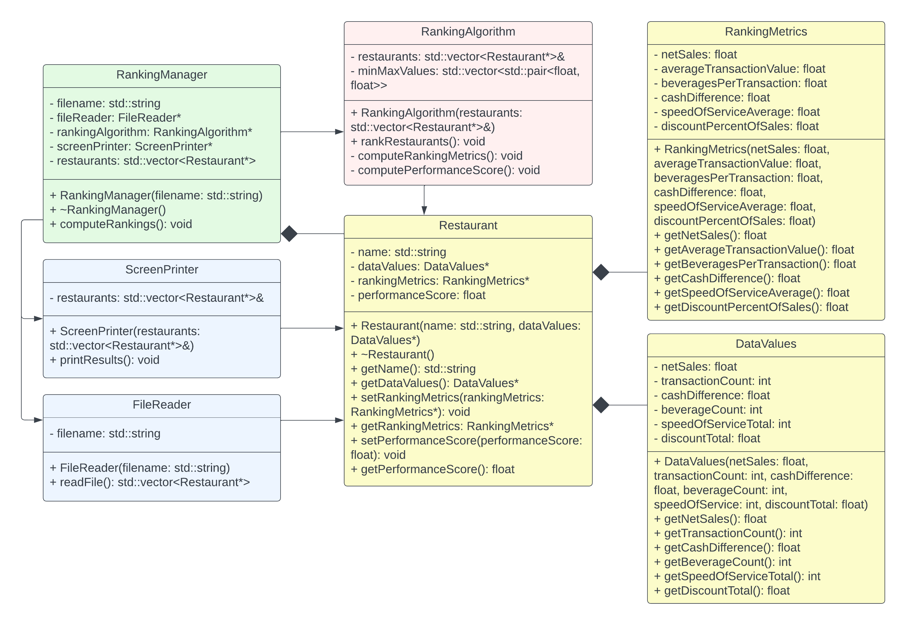

# RestaurantRanking
A simple C++ program that takes in restaurant data from a CSV file, computes performance metrics for each restaurant, and ranks them using Min-Max Normalization.

To run the program, compile from with the src folder using the command "make" in the terminal, then run using "./restaurantRank". The program will prompt the user to enter the filename of a CSV file with the restaurant data in it. Optionally, the filename can be passed as a command line argument using the command "./restaurantRank <filename>" where <filename> is the absolute or relative path to a file to be tested. A sample file has been provided, and running "./restaurantRank store-summary-data.csv" will run the program on the sample file.

The program has several classes which form 4 main subcomponents: Data, I/O, Ranking Algorithm, and Program Management.

## Data

The data subcomponent consists of three classes: Restaurant, DataValues, and RankingMetrics.

### Restaurant
Represents a restaurant and its corresponding data and metrics.

### DataValues
Represents the raw data for a restaurant obtained from a CSV file.

### RankingMetrics
Represents the performance metrics calculated from raw rata, used for ranking.

## I/O

The I/O subcomponent consists of two classes: FileReader and ScreenPrinter.

### FileReader
Represents a file reader, used for reading in data from a file.

### ScreenPrinter
Represents a screen printer, used for printing restaurant ranking results to the screen.

## Ranking Algorithm

The ranking algorithm subcomponent consists of one class, RankingAlgorithm.

### RankingAlgorithm
Represents the ranking algorithm, used for computing ranking metrics and ranking the restaurants.

## Program Management

The program management subcomponent consists of one class, RankingManager.

### RankingManager
This class represents the driver for the ranking program, controlling IO, algorithm, and data objects.

UML Class Diagram:

Created independently by Lukas Karel.
